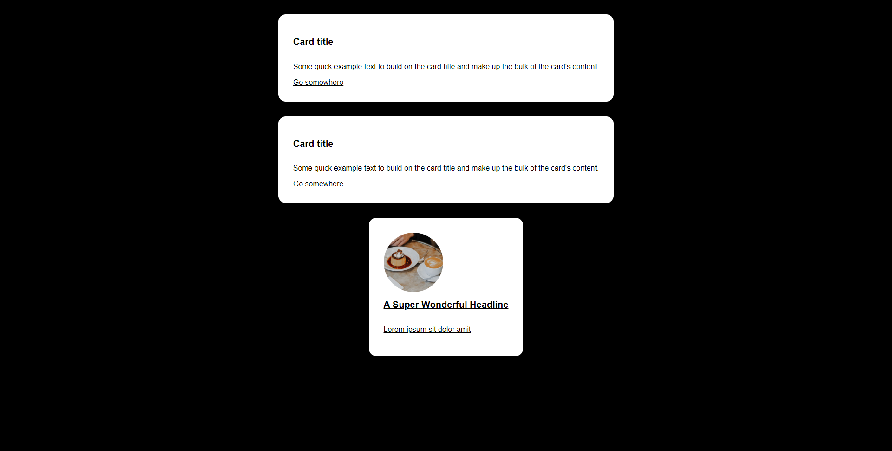

## Avant de commencer

- Verifier la présence des fichiers:
  - index.html
  - style.css
  - index-tailwind.html
  - README.md

## Présentation des fichiers

index.html est un fichier HTML qui contient le code HTML de la page. On peut l'ouvrir directement dans un navigateur. La ligne 8
```html
    <link rel="stylesheet" href="style.css">
```
nous permet d'inclure le fichier style.css dans la page. C'est cette feuille de style qui va styliser la page. Par exemple, dedans, on y trouve
```css
body {
    background-color: #090920;
    margin: 0;
    color: #f0fff0;
    display: flex;
    flex-direction: column;
    align-items: center;
}
```
qui va faire en sorte que le body soit un ``container`` de la taille de l'écran, centré, et que ses enfants (les éléments en dessous de lui) soit centré également.
```html
<container>
    <enfant/>
    <enfant/>
</container>
```

En css, les sélécteurs permettent de sélectionner des éléments dans un document HTML. Ici, on sélectionne le body avec ``body``, mais on peut aussi sélectionner des éléments via leur nom, leur class, leur id, etc.

Liste des sélecteurs: https://www.w3schools.com/cssref/css_selectors.asp

### Exercice 1: Comprendre le code HTML CSS, sans tailwind:

Regardez le code de index.html et style.css:

- Quels sont les enfants de l'élément body ?
- Quels sont les enfants de l'élément container ?
- Comment faire en sorte que la première card redirige vers la page 'https://www.google.com' quand je click sur l'anchor 'Go somewhere' ?
```html
   <a href="#">Go somewhere</a>
```
- Via la feuille de style, comment faire en sorte que toutes les anchors des cards soient en noir et en italic ?
- Recréer une troisième card ressemblant à celle-ci:
<a href="https://images.unsplash.com/photo-1611916656173-875e4277bea6?crop=entropy&cs=tinysrgb&fit=max&fm=jpg&ixid=MXwxNDU4OXwwfDF8cmFuZG9tfHx8fHx8fHw&ixlib=rb-1.2.1&q=80&w=400">Lien de l'image avec le café ici</a>


Indice:
- Manipulation d'image, d'inheritance, et surtout de recherche.